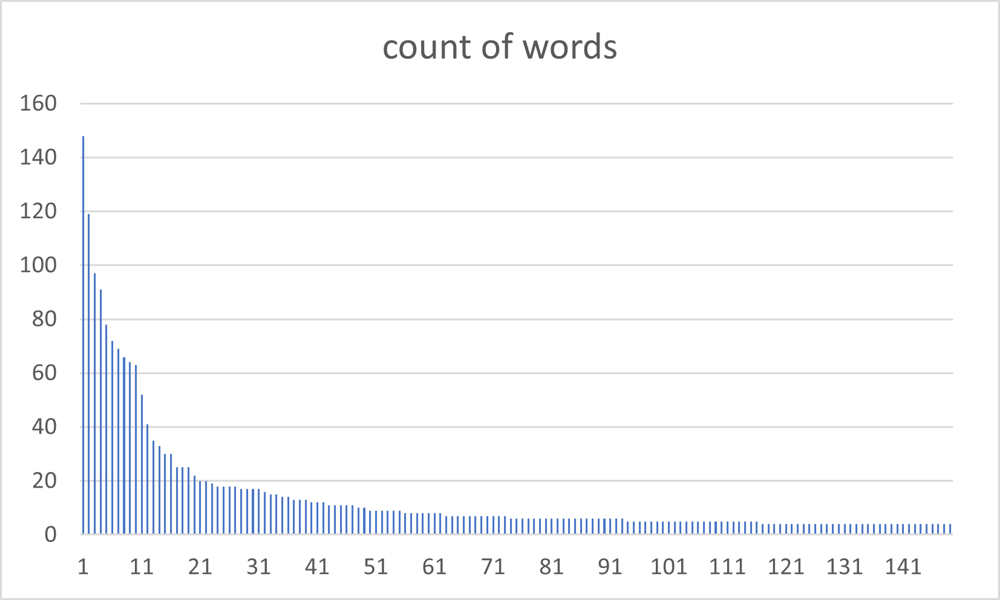

# map-reduce-OR

practicing map reduce

---

# Module 2: Python map/reduce scripts 3 Assignment
### files and code include
- 1mapRandom.py
- 1reduceRandom.py
- 2mapRandom.py
- 2reduceRandom.py
- randomTextSmall.txt
- smallRoo.txt
- smallRo.txt
- randomTextLarge.txt
- largeRoo.txt
- largeRo.txt

---

 ## Dataset

Link: [Random.com](https://randomwordgenerator.com/paragraph.php)

This Data was collected from Random.com's random paragraph generator. While gathering the data for the larger file because it is only able to make 50 random paragraphs at a time I found some repeated data and as such removed the repeated 'verbatim paragraphs'. I was unable to collect the amount of data I wanted but a sufficiently larger amount from the original 50 due to time constraints.

---

## Findings

Currently I am not able to get NLTK to remove all the stop words but As follows are my results. I have colected almost 900 unique words used by this random generator and shown in the graph bellow the most common 150. 

---

## Graph



---

### Issues

1. getting NLTK to work 
    - Solution:  uninstalled NLTK and used pip3 install instead
2. NLTk stopwords not installed
    - Solution: run ``` python -m nltk.downloader stopwords ``` in your preferred terminal